# APP_Seusuro_AutoMedic

<br>

<div align='center'>
    
</div>

<br>

---

<div align='center'>
    <h3><b>대한민국의 모든 의무대</b>를 위한</h3>
	<h3>빈틈없이 스마트한 수불 관리 앱</h3>
</div>

---

<div align='center'>
	<a href='https://seusuro.web.app'>
		
	</a>
	<br>테스트 계정 ID: <code>guest@seusuro.com</code>
	<br>테스트 계정 비밀번호: <code>1q2w3e4r</code>
</div>

<br>

<table>
<tr>
	<th>발표 자료</th>
	<th>시연 영상</th>
</tr>
<tr>
	<td>
		
	</td>
	<td>
		
	</td>
</tr>
</table>

<br>

# 📋 목차
1. [프로젝트 소개](#-프로젝트-소개)
2. [기능 설명](#-기능-설명)
3. [플랫폼별 필수 조건 안내](#-플랫폼별-필수-조건-안내-prerequisites)
4. [기술 스택](#-기술-스택-technique-used)
5. [협업 도구](#-협업-도구-collaboration-tools)
6. [설치 안내](#-설치-안내-installation-process)
7. [프로젝트 사용법](#-프로젝트-사용법-getting-started)
8. [팀 정보](#-팀-정보-team-information)
9. [저작권 및 사용권 정보](#-저작권-및-사용권-정보-copyleft--end-user-license)

<br>

## 💡 프로젝트 소개
### 🤔 문제 의식
<div align='center'>
    <a href='https://www.sedaily.com/NewsView/268P5R04OM'>
		
	</a>
</div>

<br>

올해 7월 21일, 경기 소재 모 부대 신병교육대대에서 훈련병 190명에게 ***유효기간이 지난*** 신증후군출혈열 백신을 접종하는 사고가 발생했습니다.

육군 관계자는 "백신을 접종할 때는 지침에 따라 시효일자를 확인해야 하는데 당시 간호장교와 간호부사관 모두 실수로 유효기간을 확인하지 않은 것으로 파악됐다"고 설명했습니다.

<br>

<div align='center'>
    <a href='https://www.kukinews.com/newsView/kuk202106140267'>
		
	</a>
</div>

<br>

또한, 지난해 6월 10일에는 대구 소재 모 군병원에서 군장병을 대상으로 한 화이자 백신 단체 접종을 실시하는 도중 6명이 백신 원액이 소량만 포함된 일명 '식염수 주사'를 맞는 사고가 발생했습니다.

병원 측은 당일 투약 실수를 인지했지만 ***접종자가 누구인지*** 특정하지 못하여 결국 동시간대에 접종한 장병들을 대상으로 재접종을 실시했습니다.

<br>

### 🤷‍♂️ 왜 이런 사고가 일어날까?
<table>
<tr>
	<td colspan='3'>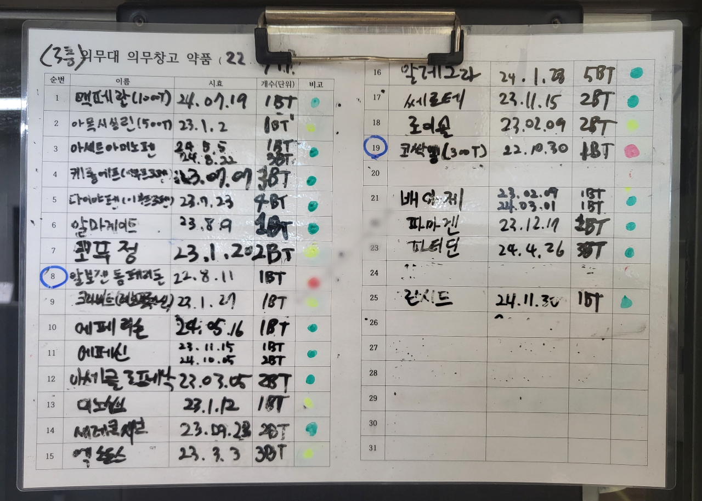</td>
</tr>
<tr>
	<td>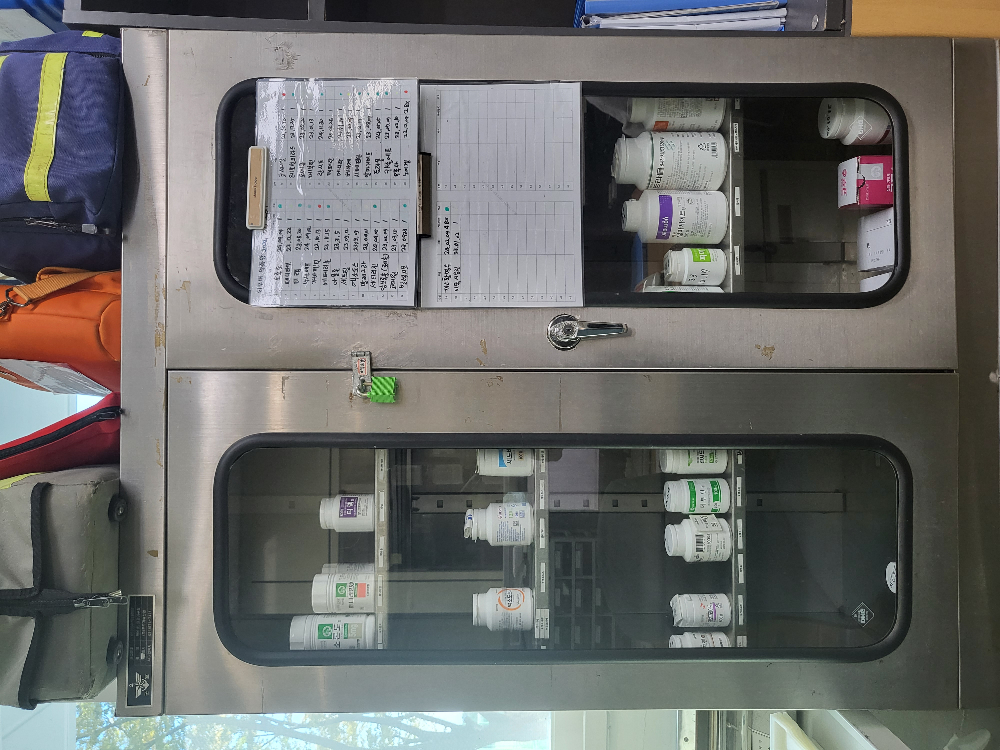</td>
	<td>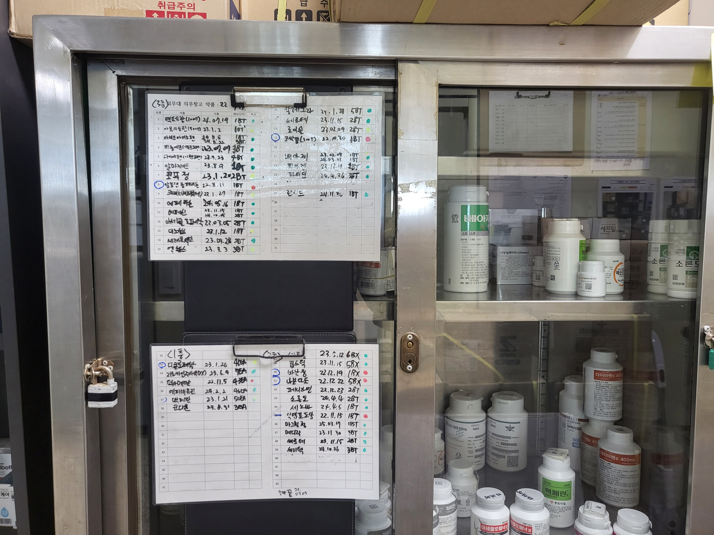</td>
	<td>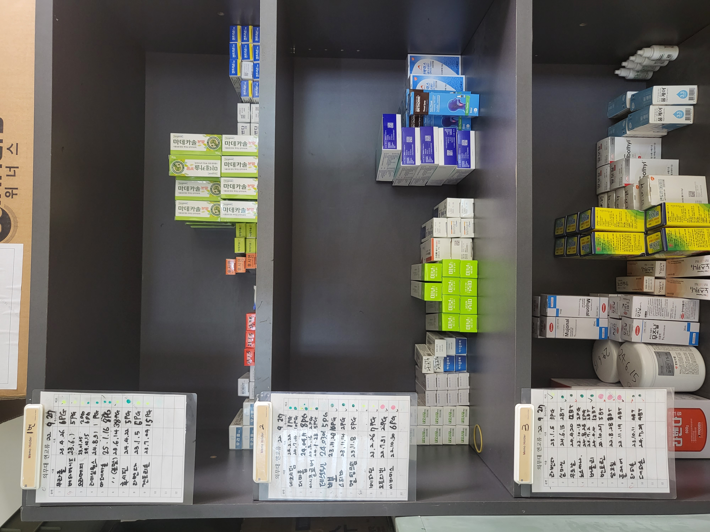</td>
</tr>
</table>

<br>

관계자 인터뷰 및 현장 조사 결과, 의무대 10곳 중 9곳은 위 사진과 같이 의약품을 포함한 모든 재산 현황을 ***수기로*** 관리하고 있었습니다.

보드마카로 기록하는 수기 관리는 항목의 추가, 수정, 삭제를 오로지 인력에만 의존하기 때문에 언제나 실수의 가능성이 있으며, 무엇보다도 실시간으로 정보가 최신화되지 않는다는 커다란 단점이 있습니다.

이를 극복하기 위해 일부 의무대에서는 엑셀 파일을 활용하여 문제를 개선하고자 하는 노력을 하고 있지만 편집 기록의 추적이 어렵고 인트라넷의 특성상 여러 컴퓨터간 파일 공유가 불가능하다는 한계점으로 인해 재산 수불 관리에 최적화된 기능들을 구축하기에는 많은 어려움이 있습니다.

<br>

### 🎤 관계자 인터뷰
- 의무병 A
	> 매일 같이 보드마카로 변동사항을 쓰고 지우고 하다 보니 코팅지가 날이 갈수록 더러워지고 글씨를 점점 알아보기 힘들어집니다. 여러 사람이 함께 손으로 쓰기 때문에 간혹 숫자를 잘못 읽고 개수를 다르게 파악하는 경우도 있습니다.
- 의무병 B
	> 재산 변동사항을 바로 수정한다고 해도 조금 이따 또 환자가 오면 어차피 지우고 다시 써야 한다는 생각 때문에 기록하는 걸 점점 미루게 됩니다. 그러다보니 수기 기록 내용과 실제 보유 현황이 일치하지 않는 일이 허다하게 일어납니다.
- 의무병 C
	> 유효기간이 지난 백신을 접종한 사건은 예견된 사고였다고 생각합니다. 현재의 수기 관리 방식을 유지하는 이상 이와 같은 사고가 언제 다시 일어난다고 해도 전혀 이상하지 않습니다.
- 응급구조부사관 D
	> DELIIS(국방군수통합정보체계)라는 전산 관리 시스템이 존재하지만 매일 소량으로 재산을 소모하는 의무대 업무 특성상 불필요한 단계가 너무 많고 번거롭습니다. 또한 유저 인터페이스가 그리 편하지도 않아서 적응하기 힘든 편입니다.
- 군의관 E
	> 환자에게 약품을 처방할 때 해당 약품이 현재 우리 의무대에 있는지 바로 파악하기가 어렵습니다. 의무대 재산 현황과 즉시 처방 가능한 약품 종류를 실시간으로 확인할 수 있었으면 좋겠습니다.

<br>

### 📱 수불 관리의 디지털화
그래서 저희는 이 모든 문제를 **빈틈없이** 해결할 수 있는 앱, ‘스수로’를 직접 개발하기로 하였습니다.

<br>

- 유효기간 임박 의약품 자동 알림
- 로그 시스템을 통한 수입/불출 기록 추적
- 각 보관장소마다 재산 현황 실시간 업데이트

<br>

→ 귀찮아서, 혹은 복잡해서 최신화가 지연되는 일이 없도록 하는 것이 '스수로'의 궁극적인 목표입니다!

<br>

- 더 자세히 알고 싶다면 [개발 계획서](https://medtopublic.notion.site/6ddb5751f6ce4b6dbe59b4aaa7aab289)를 참고해주세요!

<br>

## 📝 기능 설명
의무대를 위한 스마트한 수불 관리 앱, ‘스수로’의 핵심 기능은 크게 **4가지**입니다.<br>
이해를 돕기 위해 실제 앱 구동 화면과 함께 각 기능에 대해 설명드리겠습니다.

<br>

1. [수불 로그](#1-수불-로그)
2. [재산 현황](#2-재산-현황)
3. [약품 검색](#3-약품-검색)
4. [마이페이지](#4-마이페이지)

<br>

### 1. 수불 로그
<table>
<tr>
	<td colspan='2'><b>1-1. 수불 로그 작성</b></td>
</tr>
<tr>
	<td colspan='2'>
		사용자는 우측 하단의 펜 모양 버튼을 클릭하여 작성하고자 하는 로그 종류(수입/불출/반납/폐기)를 선택한 후,<br>
		해당 로그의 대상과 항목들을 각각 기록할 수 있습니다.
	</td>
</tr>
<tr align='center'>
	<td>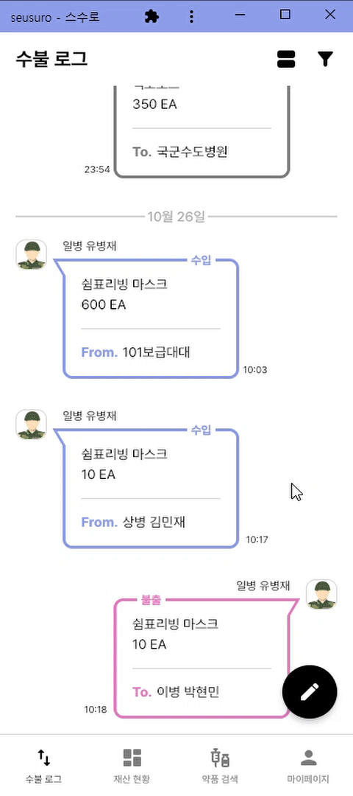</td>
	<td>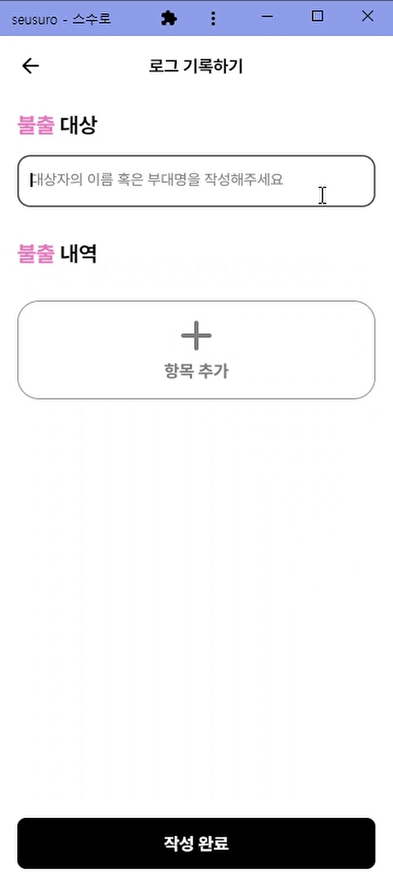</td>
</tr>
<tr align='center'>
	<td>로그 종류를 선택하는 모습</td>
	<td>불출 로그를 작성하는 모습</td>
</tr>
</table>

<br>

<table>
<tr>
	<td><b>1-2. 로그 내역 확인</b></td>
</tr>
<tr>
	<td>
		사용자는 목록에 나열된 로그를 클릭하여 각 로그에 기록된 대상과 항목들의 상세 정보를 확인할 수 있습니다.<br>
		해당 로그를 기록한 사람의 프로필 사진을 클릭하면 확인자의 프로필 정보까지 확인할 수 있습니다.
	</td>
</tr>
<tr align='center'>
	<td></td>
</tr>
<tr align='center'>
	<td>로그 내역을 확인하는 모습</td>
</tr>
</table>

<br>

<table>
<tr>
	<td><b>1-3. 보기 형식 전환</b></td>
</tr>
<tr>
	<td>
		사용자는 로그 목록의 보기 형식을 개인의 선호도에 따라 익숙한 채팅 형식의 UI와 규칙적인 블록 형식의 UI<br>
		중에서 자유롭게 선택하여 전환할 수 있습니다.
	</td>
</tr>
<tr align='center'>
	<td>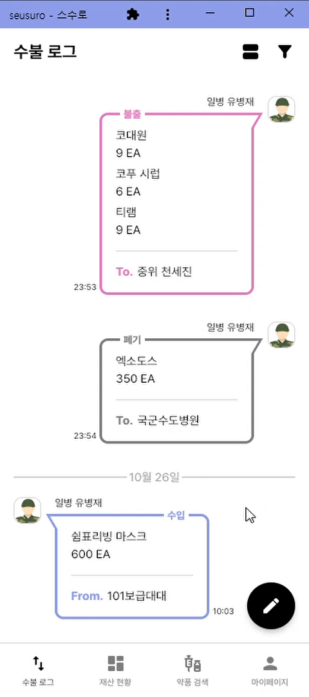</td>
</tr>
<tr align='center'>
	<td>보기 형식을 전환하는 모습</td>
</tr>
</table>

<br>

<table>
<tr>
	<td><b>1-4. 수불 로그 필터링</b></td>
</tr>
<tr>
	<td>
		사용자는 우측 상단의 필터 모양 버튼을 클릭하여 로그의 종류와 로그가 기록된 날짜를 각각 선택한 후,<br>
		필터가 적용된 수불 로그 결과를 확인할 수 있습니다.
	</td>
</tr>
<tr align='center'>
	<td></td>
</tr>
<tr align='center'>
	<td>로그 필터를 적용하는 모습</td>
</tr>
</table>

<br>

### 2. 재산 현황
<table>
<tr>
	<td><b>2-1. 재산 현황 필터링</b></td>
</tr>
<tr>
	<td>
		사용자는 상단의 세 개의 필터 버튼(분류/유효기간/보관장소)을 클릭하여 원하는 옵션을 각각 선택한 후,<br>
		필터가 적용된 재산 현황 결과를 확인할 수 있습니다.
	</td>
</tr>
<tr align='center'>
	<td></td>
</tr>
<tr align='center'>
	<td>재산 필터를 적용하는 모습</td>
</tr>
</table>

<br>

<table>
<tr>
	<td><b>2-2. 재산 상세 정보</b></td>
</tr>
<tr>
	<td>
		사용자는 목록에 나열된 재산을 클릭하여 해당 재산에 대한 기본적인 정보와 보관장소에 따른 보유량,<br>
		그리고 로그 정보를 확인할 수 있습니다.
	</td>
</tr>
<tr align='center'>
	<td></td>
</tr>
<tr align='center'>
	<td>재산 상세 정보를 확인하는 모습</td>
</tr>
</table>

<br>

<table>
<tr>
	<td><b>2-3. 재산 즐겨찾기</b></td>
</tr>
<tr>
	<td>
		사용자는 재산 상세 정보 화면에서 상단의 별 모양 버튼을 클릭하여 해당 재산을 즐겨찾기에 추가할 수 있습니다.<br>
		즐겨찾기에 추가한 재산들은 재산 현황 탭에서 우측 상단의 별 모양 버튼을 클릭하여 확인할 수 있습니다.
	</td>
</tr>
<tr align='center'>
	<td>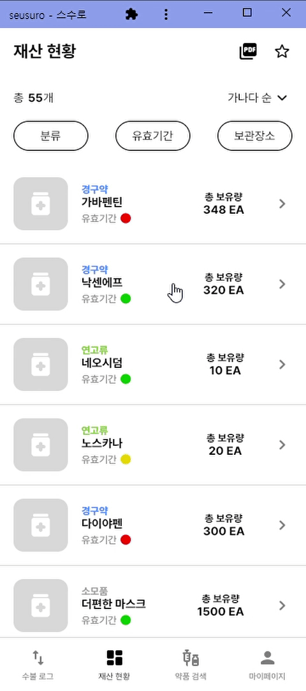</td>
</tr>
<tr align='center'>
	<td>재산을 즐겨찾기에 추가하는 모습</td>
</tr>
</table>

<br>

<table>
<tr>
	<td colspan='2'><b>2-4. PDF 내보내기</b></td>
</tr>
<tr>
	<td colspan='2'>
		사용자는 우측 상단의 PDF 내보내기 버튼을 클릭하여 인쇄할 보관장소를 선택한 후,<br>
		해당 보관장소의 재산 현황을 PDF 파일로 추출할 수 있습니다.
	</td>
</tr>
<tr align='center'>
	<td>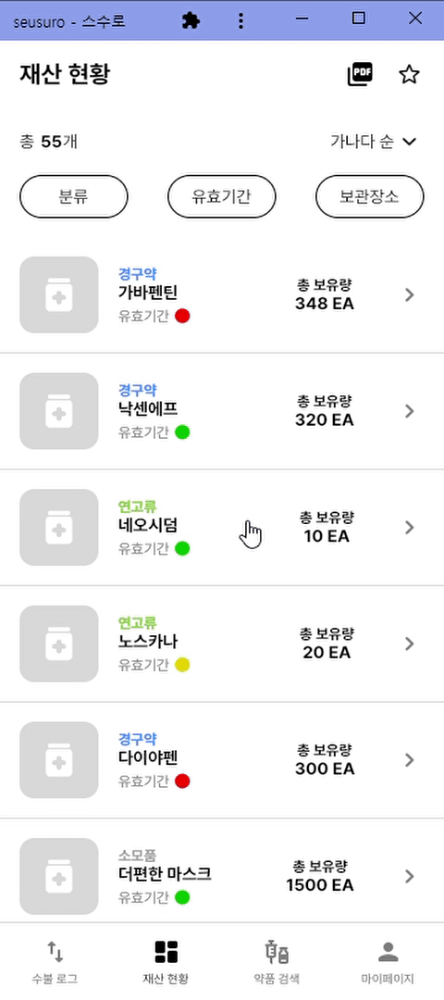</td>
	<td>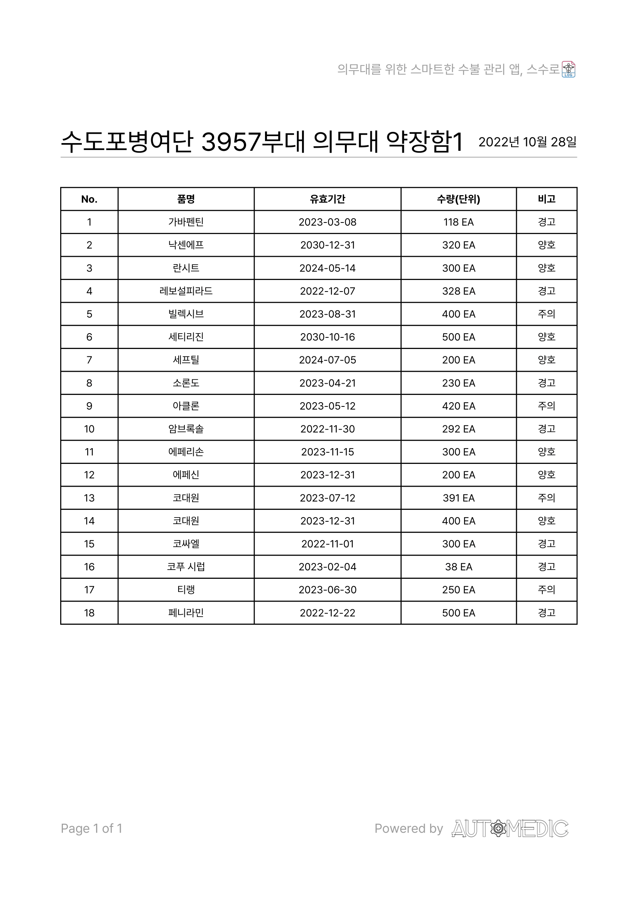</td>
</tr>
<tr align='center'>
	<td>특정 보관장소의 재산 현황을 PDF로 추출하는 모습</td>
	<td>PDF 내보내기 예시</td>
</tr>
</table>

<br>

### 3. 약품 검색
- 해당 기능에서는 식품의약품안전처에서 제공하는 [의약품개요정보 오픈 API](https://www.data.go.kr/data/15075057/openapi.do)를 활용하였습니다.

<br>

<table>
<tr>
	<td><b>3-1. 약품 검색 및 정보 확인</b></td>
</tr>
<tr>
	<td>
		사용자는 검색창에 잘 모르는 약품을 검색하고 원하는 검색 결과를 클릭하여 식품의약품안전처에서 제공하는<br>
		해당 약품의 정보를 확인할 수 있습니다.
	</td>
</tr>
<tr align='center'>
	<td></td>
</tr>
<tr align='center'>
	<td>약품을 검색하고 정보를 확인하는 모습</td>
</tr>
</table>

<br>

<table>
<tr>
	<td><b>3-2. 약품 북마크</b></td>
</tr>
<tr>
	<td>
		사용자는 약품 정보 화면에서 상단의 북마크 모양 버튼을 클릭하여 해당 약품을 북마크에 추가할 수 있습니다.<br>
		북마크에 추가한 약품들은 약품 검색 탭에서 우측 상단의 북마크 모양 버튼을 클릭하여 확인할 수 있습니다.
	</td>
</tr>
<tr align='center'>
	<td>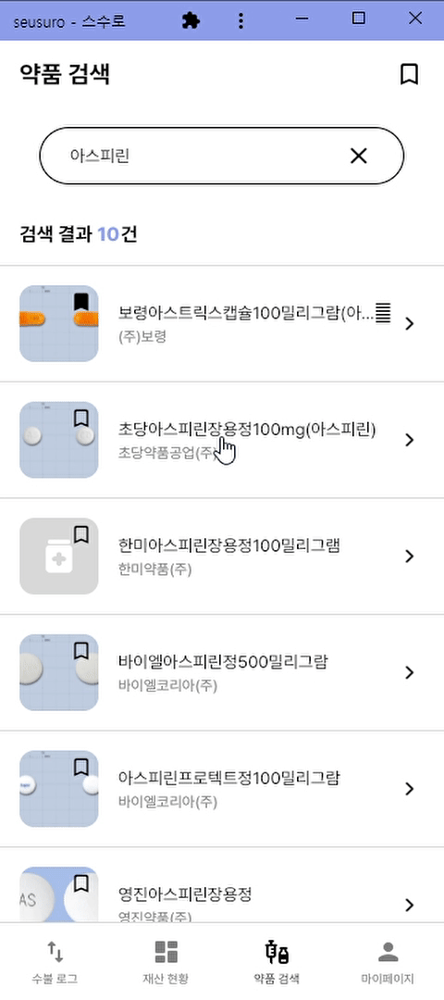</td>
</tr>
<tr align='center'>
	<td>약품을 북마크에 추가하는 모습</td>
</tr>
</table>

<br>

### 4. 마이페이지
<table>
<tr>
	<td colspan='2'><b>4. 사용자 정보 및 앱 정보 확인</b></td>
</tr>
<tr>
	<td colspan='2'>
		사용자는 자신의 프로필 정보를 확인하고 필요에 따라 수정할 수 있습니다.<br>
		또한, 앱을 제작한 팀에 대한 정보와 사용된 오픈 소스 라이선스를 확인할 수 있습니다.
	</td>
</tr>
<tr align='center'>
	<td>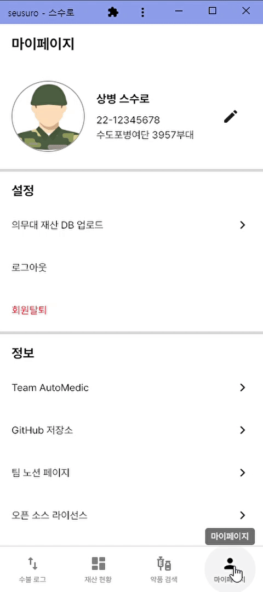</td>
	<td></td>
</tr>
<tr align='center'>
	<td>사용자 정보를 수정하는 모습</td>
	<td>오픈 소스 라이선스를 확인하는 모습</td>
</tr>
</table>

<br>

## 💻 플랫폼별 필수 조건 안내 (Prerequisites)
<table>
<tr>
	<th>Platform</th>
	<th colspan='7'>Version</th>
</tr>
<tr align='center'>
	<th scope='row'>Android</th>
	<td>
		<br>6.0</img>
	</td>
	<td>
		<br>7.0</img>
	</td>
	<td>
		<br>8.0</img>
	</td>
	<td>
		<br>9.0</img>
	</td>
	<td>
		<br>10</img>
	</td>
	<td>
		<br>11</img>
	</td>
	<td>
		<br>12</img>
	</td>
</tr>
<tr align='center'>
	<th scope='row'>iOS</th>
	<td>
		<br>iOS 11</img>
	</td>
	<td>
		<br>iOS 12</img>
	</td>
	<td>
		<br>iOS 13</img>
	</td>
	<td>
		<br>iOS 14</img>
	</td>
	<td>
		<br>iOS 15</img>
	</td>
	<td>
		<br>iOS 16</img>
	</td>
	<td></td>
</tr>
<tr align='center'>
	<th scope='row'>Web</th>
	<td>
		<br>Chrome</img>
	</td>
	<td>
		<br>Safari</img>
	</td>
	<td>
		<br>Edge</img>
	</td>
	<td>
		<br>Firefox</img>
	</td>
	<td colspan='3'></td>
</tr>
</table>

<br>

## 📚 기술 스택 (Technique Used)
### System Architecture


<br>

### Front-end
<table>
<tr>
	<th>Icon</th>
	<th>Name</th>
	<th>Version</th>
	<th>Website</th>
</tr>
<tr>
	<td>
		
	</td>
	<td>Flutter</td>
	<td align='center'>3.3.4</td>
	<td><a href='https://flutter.dev/'>https://flutter.dev/</a></td>
</tr>
<tr>
	<td>
		
	</td>
	<td>Dart</td>
	<td align='center'>2.18.2</td>
	<td><a href='https://dart.dev/'>https://dart.dev/</a></td>
</tr>
</table>

- [오픈소스 라이브러리](APP(Android)/seusuro/pubspec.yaml)

- 소프트웨어 아키텍처


### Back-end
<table>
<tr>
	<th>Icon</th>
	<th>Name</th>
	<th>Version</th>
	<th>Website</th>
</tr>
<tr>
	<td>
		
	</td>
	<td>Node.js</td>
	<td align='center'>12.22.9</td>
	<td><a href='https://nodejs.org/'>https://nodejs.org/</a></td>
</tr>
<tr>
	<td>
		
	</td>
	<td>npm</td>
	<td align='center'>8.5.1</td>
	<td><a href='https://www.npmjs.com/'>https://www.npmjs.com/</a></td>
</tr>
<tr>
	<td>
		
	</td>
	<td>Express</td>
	<td align='center'>4.18.2</td>
	<td><a href='https://expressjs.com/'>https://expressjs.com/</a></td>
</tr>
<tr>
	<td>
		
	</td>
	<td>MySQL</td>
	<td align='center'>8.0.31</td>
	<td><a href='https://www.mysql.com/'>https://www.mysql.com/</a></td>
</tr>
</table>

- [API 명세서](https://medtopublic.notion.site/91b0fe80845747d492fe813085190dc7?v=7ef50f5866e942ca80554f17cdcbb4c4)

- 개체-관계 다이어그램(ERD)


## 🧱 협업 도구 (Collaboration Tools)
<table>
<tr>
	<th style='text-align: center' scope='row'>
		<a href='https://medtopublic.notion.site/medtopublic/fd0ad5a638504e9c9cdabdb736e48a7e'>
			<br>Notion</img>
		</a>
	</th>
	<td>
		<a href='https://medtopublic.notion.site/medtopublic/fd0ad5a638504e9c9cdabdb736e48a7e'>
			
		</a>
	</td>
</tr>
<tr>
	<th style='text-align: center' scope='row'>
		<a href='https://www.figma.com/file/iuCqYWsLW2q3KZpoLPWKjN/%EC%8A%A4%EC%88%98%EB%A1%9C-%ED%94%84%EB%A1%9C%EC%A0%9D%ED%8A%B8?node-id=152%3A265'>
			<br>Figma</img>
		</a>
	</th>
	<td>
		<a href='https://www.figma.com/file/iuCqYWsLW2q3KZpoLPWKjN/%EC%8A%A4%EC%88%98%EB%A1%9C-%ED%94%84%EB%A1%9C%EC%A0%9D%ED%8A%B8?node-id=152%3A265'>
			
		</a>
	</td>
</tr>
<tr>
	<th style='text-align: center' scope='row'>
		<a href='https://seusuro.slack.com'>
			<br>Slack</img>
		</a>
	</th>
	<td>
		<a href='https://seusuro.slack.com'>
			
		</a>
	</td>
</tr>
</table>

<br>

## 🔨 설치 안내 (Installation Process)
```bash
$ git clone https://github.com/osamhack2022-v2/APP_Seusuro_AutoMedic.git
$ cd APP(Android)/seusuro
$ flutter run -d web-server --web-hostname=0.0.0.0
```

<br>

## 📖 프로젝트 사용법 (Getting Started)
- 추가 예정

- 회원가입 후 로그인

<br>
 
## 🔥 팀 정보 (Team Information)
<div align='center'>
    
</div>

<table align="center">
<tr>
	<th>Name</th>
	<th>Role</th>
	<th>Contact</th>
	<th>GITHUB</th>
</tr>
<tr>
	<td>유병재</td>
	<td>Front-end Developer, Team Leader</td>
	<td>medtopublic@naver.com</td>
	<td><a href='https://github.com/MedtoPublic'>MedtoPublic</a></td>
</tr>
<tr>
	<td>신승원</td>
	<td>Front-end Developer</td>
	<td>axolotl625@gmail.com</td>
	<td><a href='https://github.com/mengchi501'>mengchi501</a></td>
</tr>
<tr>
	<td>성준혁</td>
	<td>Back-end Developer</td>
	<td>sungjjss9707@naver.com</td>
	<td><a href='https://github.com/sungjjss9707'>sungjjss9707</a></td>
</tr>
<tr>
	<td>천세진</td>
	<td>Back-end Developer</td>
	<td>sejinnnnnn@naver.com</td>
	<td><a href='https://github.com/sejinnnnnn'>sejinnnnnn</a></td>
</tr>
</table>

<br>

## 📜 저작권 및 사용권 정보 (Copyleft / End User License)
This project is licensed under the terms of the [MIT](LICENSE.md) license.