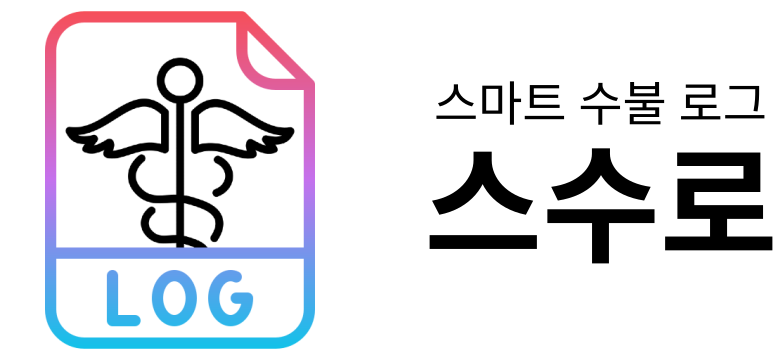
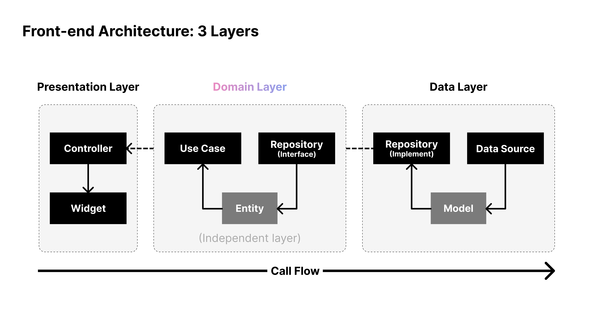
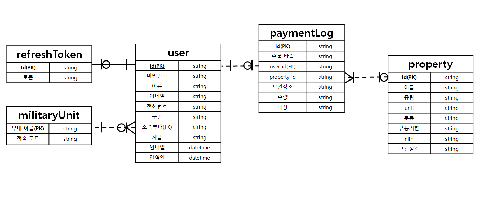
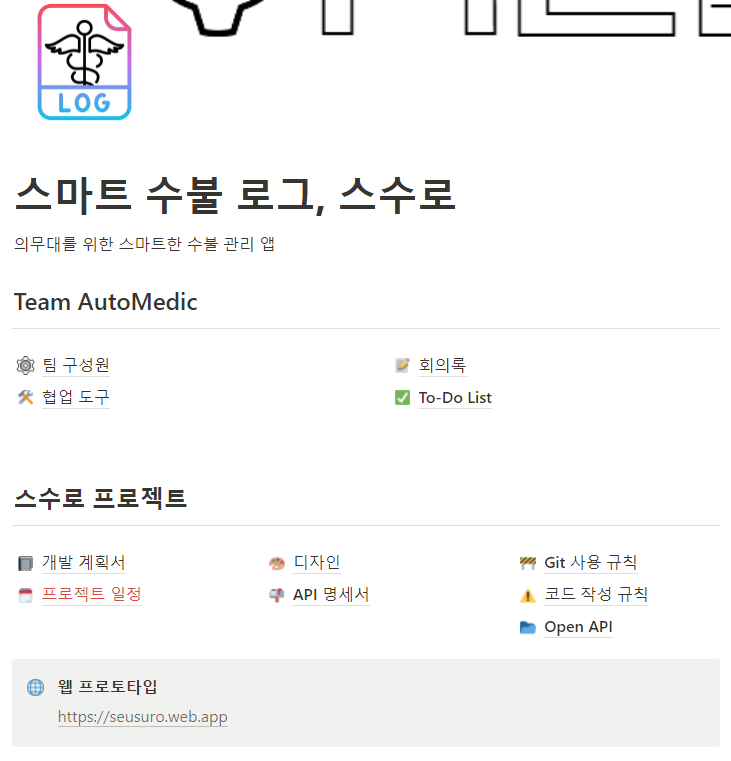
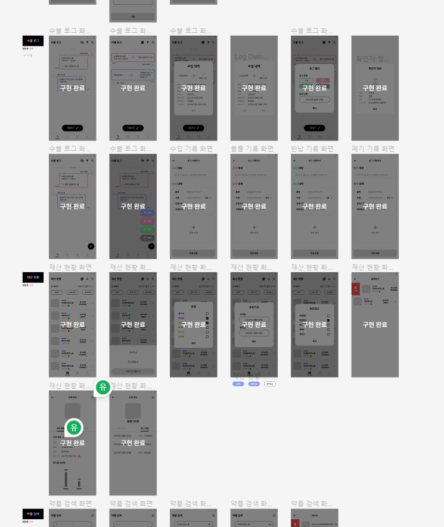
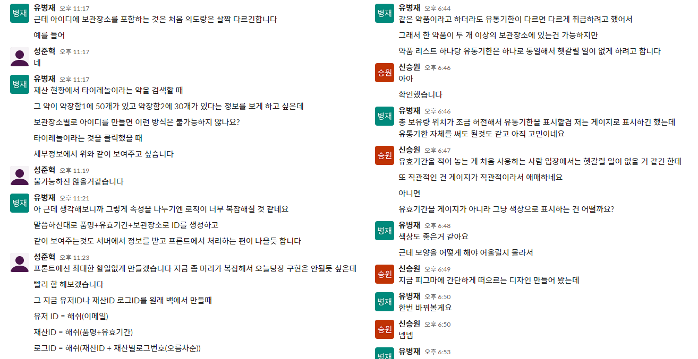

# APP_Seusuro_AutoMedic
<div align='center'>
    
</div>

<br>

---

<div align='center'>
    <h3><b>대한민국의 모든 의무대</b>를 위한<br>빈틈없이 스마트한 수불 관리 앱</h3>
	<h3><a href='https://seusuro.web.app'>웹 프로토타입 바로가기</a></h3>
</div>

---

<br>

# 📋 목차
1. [프로젝트 소개](#🤔-프로젝트-소개)
2. [기능 설명](#📝-기능-설명)
3. [컴퓨터 구성/필수 조건 안내](#💻-컴퓨터-구성--필수-조건-안내-prerequisites)
4. [기술 스택](#📚-기술-스택-technique-used)
5. [협업 도구](#🧱-협업-도구-collaboration-tools)
6. [설치 안내](#🔨-설치-안내-installation-process)
7. [프로젝트 사용법](#📖-프로젝트-사용법-getting-started)
8. [팀 정보](#🔥-팀-정보-team-information)
9. [저작권 및 사용권 정보](#📜-저작권-및-사용권-정보-copyleft--end-user-license)

<br>

## 🤔 프로젝트 소개
- 추가 예정

<br>

- 더 자세히 알고 싶다면 [개발 계획서](https://medtopublic.notion.site/6ddb5751f6ce4b6dbe59b4aaa7aab289)를 참고해주세요!

<br>

## 📝 기능 설명
- 추가 예정

- 오픈 API 활용
	- [식품의약품안전처_의약품개요정보(e약은요)](https://www.data.go.kr/data/15075057/openapi.do)

<br>

## 💻 컴퓨터 구성 / 필수 조건 안내 (Prerequisites)
- Android
	- minSdkVersion: 16
	- targetSdkVersion: 31
- iOS
- Web

<br>

## 📚 기술 스택 (Technique Used) 
### Front-end
<table>
<tr>
	<th>Icon</th>
	<th>Name</th>
	<th>Version</th>
	<th>Website</th>
</tr>
<tr>
	<td>
		
	</td>
	<td>Flutter</td>
	<td style='text-align: center'>3.3.4</td>
	<td><a href='https://flutter.dev/'>https://flutter.dev/</a></td>
</tr>
<tr>
	<td>
		
	</td>
	<td>Dart</td>
	<td style='text-align: center'>2.18.2</td>
	<td><a href='https://dart.dev/'>https://dart.dev/</a></td>
</tr>
</table>

- [오픈소스 라이브러리](APP(Android)/seusuro/pubspec.yaml)



### Back-end
<table>
<tr>
	<th>Icon</th>
	<th>Name</th>
	<th>Version</th>
	<th>Website</th>
</tr>
<tr>
	<td>
		
	</td>
	<td>Node.js</td>
	<td style='text-align: center'>TBD</td>
	<td><a href='https://nodejs.org/'>https://nodejs.org/</a></td>
</tr>
<tr>
	<td>
		
	</td>
	<td>Express</td>
	<td style='text-align: center'>TBD</td>
	<td><a href='https://expressjs.com/'>https://expressjs.com/</a></td>
</tr>
<tr>
	<td>
		
	</td>
	<td>MySQL</td>
	<td style='text-align: center'>TBD</td>
	<td><a href='https://www.mysql.com/'>https://www.mysql.com/</a></td>
</tr>
</table>



## 🧱 협업 도구 (Collaboration Tools)
<table>
<tr>
	<th style='text-align: center' scope='row'>
		<svg role="img" viewBox="0 0 24 24" xmlns="http://www.w3.org/2000/svg" height='48'><title>Notion</title><path d="M4.459 4.208c.746.606 1.026.56 2.428.466l13.215-.793c.28 0 .047-.28-.046-.326L17.86 1.968c-.42-.326-.981-.7-2.055-.607L3.01 2.295c-.466.046-.56.28-.374.466zm.793 3.08v13.904c0 .747.373 1.027 1.214.98l14.523-.84c.841-.046.935-.56.935-1.167V6.354c0-.606-.233-.933-.748-.887l-15.177.887c-.56.047-.747.327-.747.933zm14.337.745c.093.42 0 .84-.42.888l-.7.14v10.264c-.608.327-1.168.514-1.635.514-.748 0-.935-.234-1.495-.933l-4.577-7.186v6.952L12.21 19s0 .84-1.168.84l-3.222.186c-.093-.186 0-.653.327-.746l.84-.233V9.854L7.822 9.76c-.094-.42.14-1.026.793-1.073l3.456-.233 4.764 7.279v-6.44l-1.215-.139c-.093-.514.28-.887.747-.933zM1.936 1.035l13.31-.98c1.634-.14 2.055-.047 3.082.7l4.249 2.986c.7.513.934.653.934 1.213v16.378c0 1.026-.373 1.634-1.68 1.726l-15.458.934c-.98.047-1.448-.093-1.962-.747l-3.129-4.06c-.56-.747-.793-1.306-.793-1.96V2.667c0-.839.374-1.54 1.447-1.632z"/></svg>
		Notion
	</th>
	<td></td>
</tr>
<tr>
	<th style='text-align: center' scope='row'>
		Figma</img>
	</th>
	<td></td>
</tr>
<tr>
	<th style='text-align: center' scope='row'>
		Slack</img>
	</th>
	<td></td>
</tr>
</table>

<br>

## 🔨 설치 안내 (Installation Process)
```bash
$ git clone https://github.com/osamhack2022-v2/APP_Seusuro_AutoMedic.git
$ cd APP(Android)/seusuro
$ flutter run -d web-server --web-hostname=0.0.0.0
```

<br>

## 📖 프로젝트 사용법 (Getting Started)
- 추가 예정

- 회원가입 후 로그인

<br>
 
## 🔥 팀 정보 (Team Information)
<div align='center'>
    
</div>

<table align="center">
<tr>
	<th>Name</th>
	<th>Role</th>
	<th>Contact</th>
	<th>GITHUB</th>
</tr>
<tr>
	<td>유병재</td>
	<td>Front-end Developer, Team Leader</td>
	<td>medtopublic@naver.com</td>
	<td><a href='https://github.com/MedtoPublic'>MedtoPublic</a></td>
</tr>
<tr>
	<td>신승원</td>
	<td>Front-end Developer</td>
	<td>axolotl625@gmail.com</td>
	<td><a href='https://github.com/mengchi501'>mengchi501</a></td>
</tr>
<tr>
	<td>성준혁</td>
	<td>Back-end Developer</td>
	<td>sungjjss9707@naver.com</td>
	<td><a href='https://github.com/sungjjss9707'>sungjjss9707</a></td>
</tr>
<tr>
	<td>천세진</td>
	<td>Back-end Developer</td>
	<td>sejinnnnnn@naver.com</td>
	<td><a href='https://github.com/sejinnnnnn'>sejinnnnnn</a></td>
</tr>
</table>

<br>

## 📜 저작권 및 사용권 정보 (Copyleft / End User License)
This project is licensed under the terms of the [MIT](LICENSE.md) license.